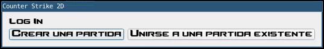

<p align="center">
  
</p>

# 7542_TpFinal
 
**Trabajo Practico Final**
 
**7542 Taller de Programación I**
 
**Facultad de Ingeniería de la Universidad de Buenos Aires (FIUBA)**
 
 
| Integrantes                            | Padrón |
| -------------------------------------- | ------ |
| Cai, Ana Maria                         | 102150 |
| Giampieri Mutti, Leonardo              | 102358 |
| Vazquez Fernandez, Francisco Manuel    | 104128 |

**Tabla de contenidos**
 
- [7542_TpFinal](#7542_tpfinal)
  - [Introducción](#introducción)
  - [Instalación](#instalación)
    - [Requerimientos de software](#requerimientos-de-software)
    - [Proceso de Instalación](#proceso-de-instalación)
    - [Proceso de Desinstalación](#proceso-de-desinstalación)
  - [Configuración](#configuración)
  - [Forma de uso](#forma-de-uso)
    - [Ejecución](#ejecución)
    - [Ciclo del juego](#ciclo-del-juego)
      - [Fases de una ronda](#fases-de-una-ronda)
        - [Fase de preparación](#fase-de-preparación)
        - [Fase de final](#fase-de-final)
    - [Controles](#controles)
    - [Armas](#armas)
    - [Mapa](#mapa)
    - [Editor de mapas](#editor-de-mapas)
      - [Creación de mapas](#creación-de-mapas)
      - [Edición de mapas](#edición-de-mapas)
      - [Insertar y mover elementos en el mapa](#insertar-y-mover-elementos-en-el-mapa)
 
## Introducción
 
El presente trabajo consiste en diseñar e implementar una recreación 2D del clásico juego Counter Strike.
En este, los jugadores se agruparán al bando de los terroristas (terrorist) o de los anti-terroristas (counter
terrorist) en una pelea armada “n versus m” (configurable).

## Instalación

### Requerimientos de software

A continuación se presenta OS, bibliotecas y herramientas necesarias para instalar el programa.

El Sistema Operativo requerido es alguna versión de Ubuntu.

El listado de bibliotecas necesitadas para instalar el programa que instala el instalador son:

- clang
- make
- build-essential
- qt5-default
- libqt5multimedia5-plugins
- qtmultimedia5-dev
- libyaml-cpp-dev
- libsdl2-dev
- libsdl2-image-dev
- libsdl2-gfx-dev
- libsdl2-mixer-dev 
- libsdl2-ttf-dev

 
### Proceso de Instalación

Para instalar las dependencias del juego se debe correr los siguientes comandos en la consola:
 
```console
git clone https://github.com/fvazquezf/7542_TpFinal
```
 ```console
cd 7542_TpFinal
```
```console
sh installer.sh
```
### Proceso de Desinstalación
 
Para instalar las dependencias del juego se debe correr el siguiente comando en la consola con la deseada cantidad de 'flags':
 
```console
sh desinstaller.sh <flags>
```
 
Flags soportados y su comportamiento:
 
- `--qt`:  borra las dependencias de qt
- `--sdl`:  borra las dependencias de sdl2
- `--yaml`:  borra las dependencias de yaml-cpp
- `--cpp`:  borra las dependencias: clang, cmake, make y build-essential
- `--repo`:  elimina el repositorio
- `--box2d`: elimina box2d
- `--cs2d`: borra el contenido del juego (puede encontrarse en `/var/cs2d/`)
- `--all`:  borra las dependencias de qt, sdl2, yaml-cpp, clang, cmake, make y build-essentials, elimina el repositorio, el juego y box2d

## Configuración
 
Para configurar los parámetros de juego debe acceder al archivo `server_config.yaml` (`/var/cs2d/config/server_config.yaml`).
Actualmente, se puede modificar la vida de los jugadores, el dinero inicial y la cantidad de jugadores por partida. Ademas de los parámetros de las armas. Las distancias de los mismos están configurados en centímetros, y los tiempos en tics del mundo (actualmente 60 por segundo)
Parámetros de las armas:

- ammo: munición en el cartucho. cantidad de balas que se pueden disparar antes de recargar.
- range: rango de disparo. Distancia máxima que registra un golpe.
- pistol/shotgun/bomb_accuracy: Angulo/2 que registra el golpe. El area de acierto se determina por una sección de circunferencia, la accuracy de estas armas determinan que tan amplio es este circulo. Los valores van de 0 (nunca pega) a 180 (todo el circulo, pega hasta atrás del jugador).
- rifle/awp/pistol_accuracy: distancia de la trayectoria al centro del jugador enemigo. Mientras mas grande este numero, mas probable es que le pegue al jugador enemigo. Valor mínimo: 0.
- damage: daño que inflinge el arma al acertar.
- firerate: Tiempo entre un golpe y el próximo. Las armas que no tienen esta variable golpean siempre que se hace click.
- bomb_fuse: tiempo que tarda la bomba en explotar
- bomb_activate_time: tiempo que tarda la bomba en plantarse/defusearse.


## Forma de uso

### Ejecución

Luego de la "Instalacion", se generan tres ejecutables: `cs2d_server`, `cs2d` y `cs2d_editor`.

Al estar localizados en `/usr/bin`, podemos ejecutarlos globalmente (no necesitamos acceder a la carpeta build del repo).

El primer ejecutable, es el servidor del juego. Este requiere como parametro el puerto donde se realizara la conexión.

```console
cs2d_server <puerto>
``` 


El archivo de configuracion del server lo podemos localizar en la ruta `/var/cs2d/config/` bajo el nombre `server_config.yaml`.
En este archivo podemos encontrar configuraciones del juego en si (vida de los jugadores, plata inicial, velocidad de disparo de armas...).

El segundo ejecutable es el cliente. No requiere ningun parámetro adicional.

```console
cs2d
``` 
Nos encontraremos con la siguiente pantalla, en donde podremos ingresar la ip y el puerto correspondientes al servidor.


Podemos localizar el archivo de configuracion del cliente en `/var/cs2d/config` con el nombre `client_config.yaml`.
En el, podremos seleccionar la resolucion del juego, si es fullscreen o no, podremos desactivar el sonido, configurar el stencil y muchas cosas mas.

Finalmente, el ultimo ejecutable es el editor de mapas del juego. Para ello, se debe escribir en la consola:

```console
cs2d_editor 
``` 

### Ciclo del juego

Una vez que se levanta el servidor, se pueden correr clientes. Se puede elegir entre crear o unirse a una partida.



Si se elige crear una partida, indicar el mapa a utilizar y el nombre de la misma. Después de esto se debe esperar a que se conecte al menos un jugador.


Si se elige unirse a una partida, selecciona la partida a la que quieras unirte. En cualquier caso, podes tocar el boton de empezar la partida para que inicie con menos jugadores de los que hay. 


El juego consiste en una R cantidad configurable de rondas. Un equipo juega la mitad de rondas en un bando como terrorista y la otra mitad anti-terroristas y viceversa.

Una vez finalizada las R rondas, el equipo con más victorias será el ganador.

Al finalizar la partida se mostrará un tablero de puntuaciones, con la cantidad de asesinatos, muertes y dinero recolectado de cada jugador, en un ranking por cada equipo.

#### Fases de una ronda

Una ronda posee dos fases: la fase de preparación y la fase final.

##### Fase de preparación

La primer fase consiste en la 'preparación' o una cantidad de segundos en la que ningún jugador puede moverse para comprar el armamento necesario para la ronda. Tambien puede seleccionar el skin con el que quiera ver a su equipo.


Cada arma posee un precio a excepción del cuchillo y pistola que representan el equipamiento default del personaje.

Cada jugador puede poseer tres armas: la pistola, el cuchillo y un arma extra.

Las armas tienen un precio. Un jugador puede tener 3 armas en su equipo (4 si son terroristas con la
bomba): el cuchillo, la pistola y un arma principal extra que puede comprar o levantar si se encuentra como drop en el mapa.

El equipamiento que jugador posee en una ronda se conserva entre las distintas rondas si este no fue asesinado. En el caso de que efectivamente haya sido asesinado, si posee arma extra, esta es dejada en el mapa forma de drop.

Las armas cuestan dinero, cada jugador cuenta con un saldo, que va aumentando en cada ronda con una suma inicial, y también cuenta con bonificaciones. Estas bonificaciones son obtenidas al ganar una ronda, o al matar a un rival.

##### Fase de final

Luego de la fase preparación, viene la fase final. La fase final finaliza cuando sucede alguno de los siguientes eventos:

- Todo el equipo contrario muere.
- Los terroristas activaron la bomba en los monumentos, y esta explota.
- Los anti-terroristas desactivan la bomba.

### Controles

- Movimiento direccional con `W` `A` `S` `D`
- Recarga de armas con `R`
- Plant/defuse de la bomba con `ESPACIO`
- Cambio de armas con 1, 2, 3, 4:
  - `1` = arma principal (Awp, Ak47, Shotgun)
  - `2` = arma secundaria (pistola)
  - `3` = cuchillo
  - `4` = bomba (solo para Terroristas)
- PickUp de arma con `E`
- Atacar con el click izquierdo del mouse

### Armas

- Bomba: Arma exclusiva de los terroristas. Solo hay una por partida y la recibe al empezar el juego
de forma aleatoria un integrante del bando terrorista. Si este muere, esta aparece en forma de drop en el
piso, para que otro integrante pueda tomarla y activarla. Se debe de activar la bomba en uno de los puntos
indicados del mapa.

- Cuchillo: es el arma por default cuando el jugador se queda sin balas. A diferencia del resto de las armas está solo produce daño si
el jugador está al lado del enemigo.

- Glock: Solo puede disparar de a una bala cada vez que el jugador presione el click izquierdo.
Tiene un daño mayor que el cuchillo a una distancia adecuada.

- AK-47: Dispara de a 3 balas por rafaga. El jugador puede seguir disparando ráfagas si mantiene presionado el click izquierdo. En este caso las rafagas tendrán una frecuencia de 0.4 balas/sec (no hay un disparo perfectamente contiguo).
El daño de las balas impactadas es menor que la pistola.M3: Hace daño en área, en forma de cono (los proyectiles se dispersan). Tiene una distancia de alcance menor a las anteriores. Solo se puede disparar una vez que el jugador presione el click izquierdo.
Su daño es muy grande si el disparo se realiza a corta distancia del objetivo.

- AWP: Arma con el mayor alcance. Su disparo, cuando acierta causa el máximo impacto.
Tiene un tiempo de retardo entre disparo y disparo alto. Su daño no se ve afectado por la distancia del objetivo. Es el arma más cara del juego.

### Mapa
 
 En el mapa puede haber armas en el suelo, para que cualquier usuario lo pueda recolectar al pasar por
encima de él. Estos ítems en el suelo pueden provenir:

- Un drop de un personaje muerto.
- Un drop debido a que un personaje compró otra arma principal.
- El mapa contaba con items desperdigados por ahí.

### Editor de mapas
 
El juego provee un "Editor de mapas" que consiste en un programa que permite a los jugadores crear y editar mapas que luego va a poder jugar.
 
Este programa se ejecuta con el siguiente comando:
 
```console
cs2d_editor
```
 
Luego, aparece una pantalla donde se van a visualizar los mapas ya creados.
 
#### Creación de mapas
 
Si se desea crear un mapa de cero se debe clickear en el botón "Create".
 
El usuario debe introducir el nombre del mapa y el tamaño de este.
 

 
Una vez completado este paso, se debe clickear el botón "Continue" para poder colocar elementos en el mapa.
 

 
Cuando se quiera guardar los cambios se debe clickear en el botón "Save".
 
#### Edición de mapas
 
Si se desea editar algún mapa ya existente se debe clickear el nombre de tal mapa en la lista y luego clickear el botón "Edit".
 

 
Cuando se quiera guardar los cambios se debe clickear en el botón "Save".
Los mapas se van a guardar en el directorio `/var/cs2d/maps`.
 
#### Insertar y mover elementos en el mapa
 
El mapa provee una lista de cuatro tipos de elementos en el mapa:
 
- background: fondo del mapa (uno por mapa)
- weapons: armas del mapa
- walls: paredes o zonas donde el jugador no puede pasar
- zones:
 - zoneA: zona donde empieza un equipo el juego
 - zoneB: zona donde empieza el otro equipo el juego
 - zoneBomb: zona donde se quiere colocar las bombas
 

 
Para poder insertar tales elementos en el mapa se debe primero clickear en el nombre de la categoría para desplegar sus opciones.
Luego, se debe primero clickear el elemento que desea insertar y segundo clickear las posiciones en el mapa donde se quiere colocar tal elemento.
 
Para poder mover elementos en el mapa se debe clickear al elemento que se quiere mover y soltar el cursor en la posición nueva del mapa.
 


Cada mapa debe tener una de las tres zonas mencionadas y estas zonas deben ser rectangulares.
Para configurar aquello, se debe indicar con cuatro marcas en el mapa tal que se forme un rectangulo. Si se pone una maraca de mas, se pone un elemento sobre esa marca o se ponen cuatro marcas que no forman un rectangulo, toda la zona se elimina automaticamnete.
